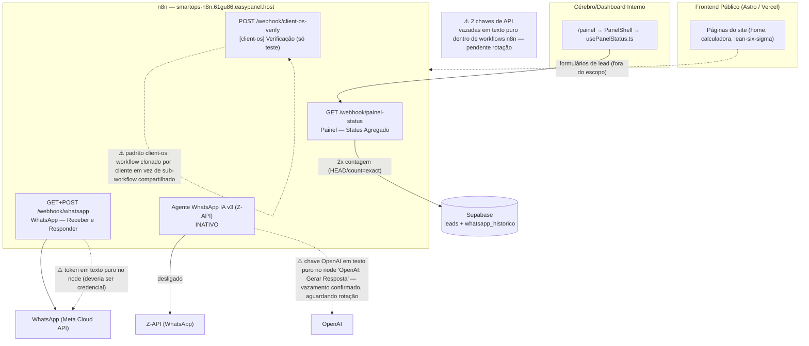

# Arquitetura — SmartOps SEO (Astro + n8n)

> Fora do escopo por decisão do dono: captura e classificação de leads (workflows "Captura de Leads" e "QUENTE-MORNO-FRIO / SDR IA"). As páginas que têm formulário de lead existem, mas o webhook que elas chamam não é detalhado aqui.

## Parte 1 — Lado Astro (escaneado no código local)

### Frontend Público
Site estático em Astro, publicado na Vercel (`smartops-ia.com.br`).

| Página / arquivo | Chamada externa |
|---|---|
| `src/pages/index.astro` | formulário de lead (não detalhado, ver nota acima) |
| `src/pages/calculadora-desperdicio.astro` | formulário de lead (não detalhado) |
| `src/pages/lean-six-sigma/index.astro` | formulário de lead (não detalhado) |
| Demais páginas `src/pages/*.astro` e `src/scripts/home/*` | nenhuma chamada `fetch()`/HTTP para fora (os scripts da home são só animação/efeitos visuais) |

### Cérebro/Dashboard Interno
Página pública `/painel` (`smartops-ia.com.br/painel`), que mostra o status do ecossistema.

| Arquivo | Papel | Chamada externa |
|---|---|---|
| `src/pages/painel.astro` | página; carrega `<PanelShell client:load />` | — |
| `src/components/panel/PanelShell.tsx` | componente raiz; usa `usePanelStatus()` e repassa os dados aos cards | — |
| `src/components/panel/usePanelStatus.ts` | hook de busca de dados | `GET https://smartops-n8n.61gu86.easypanel.host/webhook/painel-status` |
| `src/components/panel/StatusCard.tsx`, `DmaicStrip.tsx`, `ExecutionTerminal.tsx` | componentes visuais | — |

Cadeia: `painel.astro` → `PanelShell` → `usePanelStatus.ts` → webhook `painel-status` no n8n.

### Código de apoio (não é chamado pelo site)
- `src/lib/meta-capi.js` — funções para enviar eventos à Meta Conversions API (`https://graph.facebook.com/v20.0/{PIXEL_ID}/events`). O próprio cabeçalho diz que é para ser colado em um nó "Code" do n8n; não é importado por nenhuma página.

## Parte 2 — Lado n8n (verificado ao vivo pela outra IA com acesso ao n8n; incorporado literalmente)

## Backend (n8n) — smartops-n8n.61gu86.easypanel.host

### Ativos
- **Painel — Status Agregado** — GET /webhook/painel-status (CORS liberado)
  Fluxo: Webhook → 2x Supabase (contagem leads + whatsapp_historico via HEAD/count=exact) → monta JSON do contrato → responde
  Degrada graciosamente se Supabase falhar (mostra "—" em vez de quebrar)
  Consumido por: src/pages/painel.astro → publicado em smartops-ia.com.br/painel

- **WhatsApp — Receber e Responder Mensagens** — GET+POST /webhook/whatsapp (Meta Cloud API)
  ⚠️ Token do WhatsApp gravado em texto puro no node (deveria ser credencial)

- **[client-os] Verificação de Integração** — POST /webhook/client-os-verify (só teste, sem dependências)

### Inativos
- **SMARTOPS - Agente WhatsApp IA v3** (Z-API) — desligado
  ⚠️ Chave da OpenAI gravada em texto puro no node "OpenAI: Gerar Resposta" — vazamento confirmado, aguardando rotação

### Problemas estruturais conhecidos
- ⚠️ 2 chaves de API vazadas em texto puro dentro de workflows n8n — pendente rotação
- ⚠️ Padrão "client-os": workflow clonado por cliente em vez de sub-workflow compartilhado — identificado como desperdício Lean, não corrigido ainda

## Parte 3 — Diagrama

Observação: nenhum workflow da Parte 2 usa Telegram. Os alertas de Telegram pertencem aos fluxos de leads, que ficaram de fora desta documentação.
